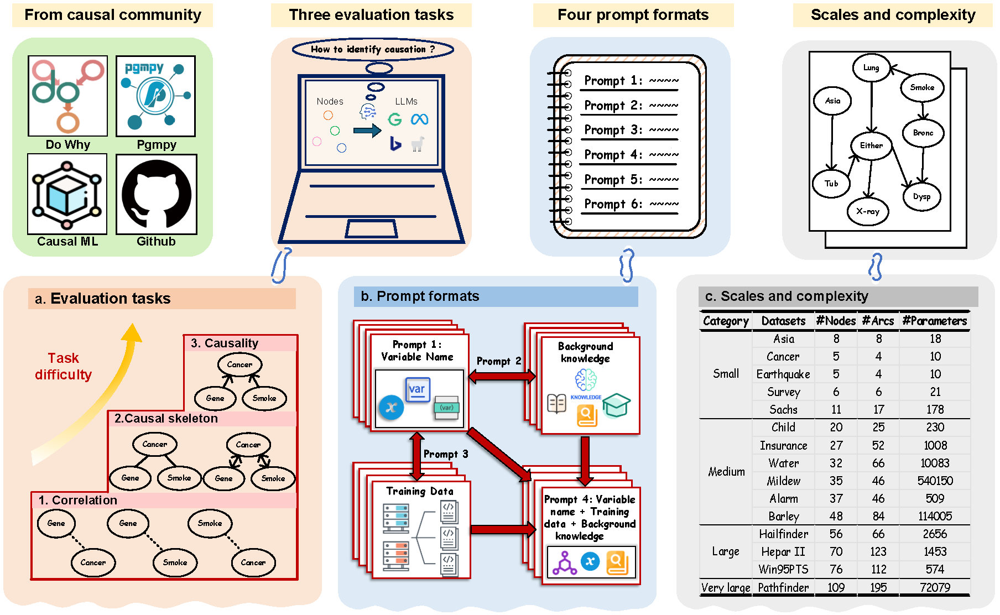

# CausalBN-Bench

Source code for **CausalBN-Bench: A Comprehensive Benchmark for Causal Learning Capability of LLMs**.

CausalBN-Bench evaluates large language models on Bayesian-network-based causal learning tasks:

- Correlation identification
- Causal skeleton identification
- Causality identification

The full benchmark dataset is hosted on Hugging Face Datasets:

https://huggingface.co/datasets/IEEERainy/CausalBN-Bench

## Overview



## Repository Layout

```text
CausalBN-Bench/
  tasks/
    correlation_identification/
    causal_skeleton_identification/
    causality_identification/
      direct_causality_prompts/
      variable_name_prompts/
  prompt_formats/
    background_knowledge/
  appendix/
    variable_refactorization/
    causal_strength/
    original_prompt_baseline/
  source_networks_and_labels/
  evaluation/
  experiments/
    model_inference/
    sample_outputs/
  baselines/
    finetuning/
  examples/
    asia_minimal_walkthrough/
    misc_samples/
  scripts/
  docs/
```

## Paper Task Mapping

| Paper benchmark component | Source-code path | Hugging Face dataset path |
| --- | --- | --- |
| Correlation identification | `tasks/correlation_identification/` | `data/main_tasks/correlation_identification/` |
| Causal skeleton identification | `tasks/causal_skeleton_identification/` | `data/main_tasks/causal_skeleton_identification/` |
| Causality identification, direct-cause prompts | `tasks/causality_identification/direct_causality_prompts/` | `data/main_tasks/causality_identification/direct_causality_prompts/` |
| Causality identification, variable-name prompts | `tasks/causality_identification/variable_name_prompts/` | `data/main_tasks/causality_identification/variable_name_prompts/` |
| Background-knowledge prompt format | `prompt_formats/background_knowledge/` | `data/prompt_formats/background_knowledge/` |
| Variable refactorization appendix | `appendix/variable_refactorization/` | `data/appendix/variable_refactorization/` |
| Causal-strength appendix exploration | `appendix/causal_strength/` | `data/appendix/causal_strength/ranking/` |
| Source Bayesian networks and labels | `source_networks_and_labels/` | `data/source_networks_and_labels/` |

See `docs/CODE_STRUCTURE.md` for a fuller description of the source layout.

## Installation

```bash
pip install -r requirements.txt
```

## Download The Full Benchmark Data

The GitHub repository contains source code and small examples. Large generated benchmark files are stored on Hugging Face.

```bash
pip install -U huggingface_hub
python scripts/download_data.py
```

By default, the downloader fetches `IEEERainy/CausalBN-Bench` into:

```text
data/CausalBN-Bench/
```

## API Keys

Do not hard-code API keys. Set them as environment variables:

```bash
export OPENAI_API_KEY="..."
export HUGGINGFACE_API_KEY="..."
```

## Usage Examples

Generate direct-causality prompts:

```bash
python tasks/causality_identification/direct_causality_prompts/generate_alarm.py
```

Generate correlation-identification prompts:

```bash
python tasks/correlation_identification/generate_alarm.py
```

Run zero-shot GPT inference with explicit input and output files:

```bash
python experiments/model_inference/run_gpt_zeroshot.py \
  --input-file data/CausalBN-Bench/data/main_tasks/correlation_identification/questions_alarm.csv \
  --output-file results/correlation_identification/gpt4_alarm.csv \
  --model gpt-4
```

Generate background-knowledge answers with an OpenAI-compatible endpoint:

```bash
python prompt_formats/background_knowledge/obtained_knowledge/run_gpt.py \
  --input-dir prompt_formats/background_knowledge/obtained_knowledge \
  --output-dir results/background_knowledge \
  --datasets win95pts \
  --models gpt-4
```

The repository contains both polished entry points and original research scripts. Polished scripts use command-line arguments and environment variables. Older experiment scripts are retained for reproducibility and may still require local model paths or output-directory adjustments.

## Minimal Example

A cleaned Asia-only example is included for smoke tests:

```bash
cd examples/asia_minimal_walkthrough
export OPENAI_API_KEY="..."
python inference_examples/causality_identification/Causal_inference.py
```

This example keeps small Asia prompt/question/label files and inference/evaluation scripts, while removing cache files, pickle caches, hard-coded API keys, and local machine paths.


## Citation

```bibtex
@ARTICLE{causalbnbench,
  author={Zhou, Yu and Wu, Xingyu and Wu, Jibin and Feng, Liang and Tan, Kay Chen},
  journal={IEEE Transactions on Artificial Intelligence},
  title={CausalBN-Bench: A Comprehensive Benchmark for Causal Learning Capability of LLMs},
  year={2026},
  volume={},
  number={},
  pages={1-15},
  doi={10.1109/TAI.2026.3703427}
}
```

## License

Add a license before public release. Common choices are MIT or Apache-2.0 for code and CC BY 4.0 for benchmark data.
